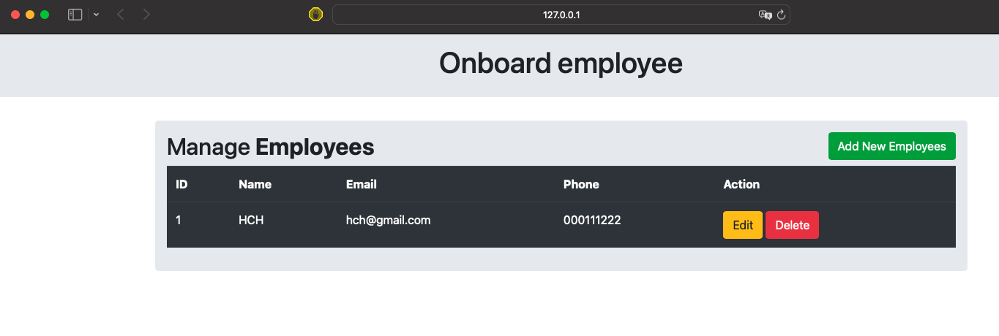

# Simple Application to manage employees




## Prerequisites

To install the package requirements, need to activate a virtualenv

## Usage

1. Clone repo on your local machine and switch to script folder.

   ```bash
   git clone https://github.com/HASHKS1/PythonS.git
   cd EmployeesApp
   ```

2. Run the following cmd

   ```bash
   virtualenv venv 
   source venv/bin/activate
   ```

3. Install the requirements

   ```bash
    pip3 install -r requirements.txt
   ```

4. Run your application 

   ```bash
    python3 app.py
   ```

5. Leave your Python virtualenv

   ```bash
    deactivate
   ```