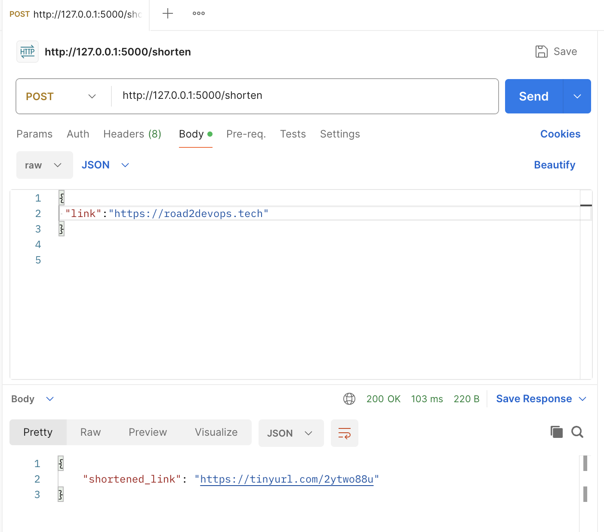

# URL Shortening Service API

This is a simple Flask-based API that allows you to shorten URLs using the `pyshorteners` library. The service accepts a long URL and returns a shortened version of it.

## Table of Contents

- [Installation](#installation)
- [Usage](#usage)
- [API Endpoints](#api-endpoints)
- [Running the Application](#running-the-application)
- [Demo](#demo)

## Installation

1. Clone repo on your local machine and switch to script folder.

   ```bash
   git clone https://github.com/HASHKS1/PythonS.git
   cd ShortenLinksApi
   ```

2. Install the requirements

   ```bash
    pip3 install -r requirements.txt
   ```

4. Run your application 

   ```bash
    python3 app.py
   ```
## Usage

This service provides an API endpoint where you can pass a URL and receive a shortened version in return. The API is built using Flask and leverages the pyshorteners library to perform the URL shortening.

   ```bash
    curl --location 'http://127.0.0.1:5000/shorten' \
--header 'Content-Type: application/json' \
--data '{
 "link":"https://road2devops.tech"
}

'
   ```

## API Endpoints

POST /shorten
Description: Shortens a given URL.

- Request:
    - URL: /shorten
    - Method: POST
    - Content-Type: application/json
    - Body: JSON object with the key "link", containing the URL to be shortened.

   ```bash
    {
    "link": "https://www.example.com"
    }

   ```

- Response:
    - Content-Type: application/json
    - Body: JSON object with the key "shortened_link", containing the shortened URL.


   ```bash
    {
    "shortened_link": "http://tinyurl.com/abc123"
    }

   ```

- Error Handling:
    - If the "link" key is missing, the API returns a 400 status with an error message.
    - If an error occurs during the shortening process, the API returns a 500 status with an error message.

## Running the Application

1. Run the Flask app:
   ```bash
    python3 app.py

   ```
2. Access the API:

    The API will be accessible at http://127.0.0.1:5000/shorten.

3. Test the API:
    
    You can test the API using tools like curl, Postman, or any other HTTP client.
Example with curl:

   ```bash
    curl -X POST -H "Content-Type: application/json" -d '{"link": "https://www.example.com"}' http://127.0.0.1:5000/shorten


   ```
## Demo

